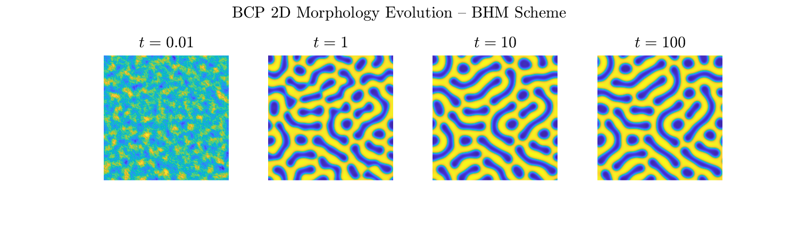
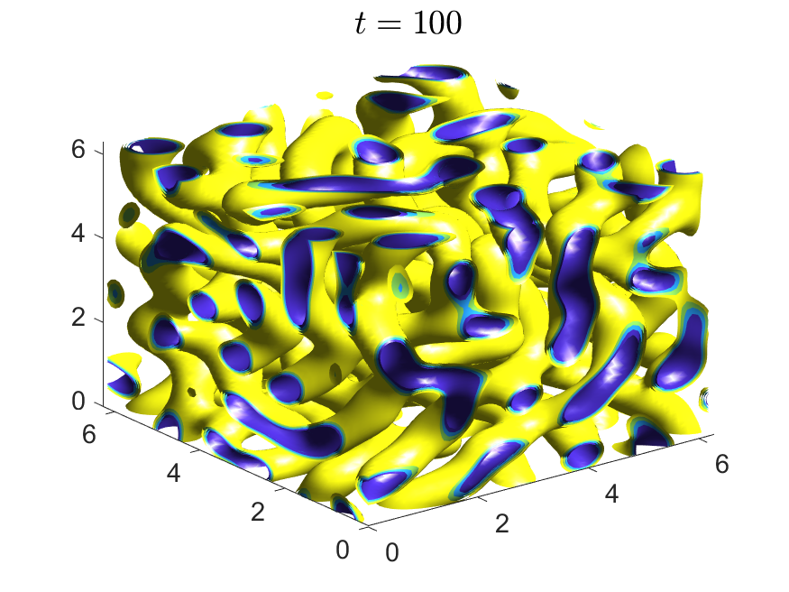
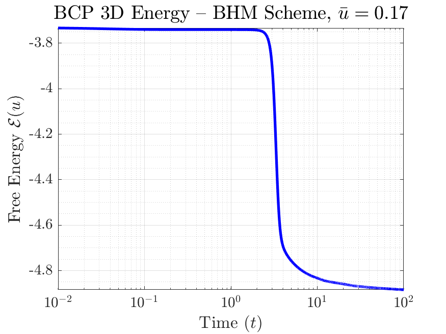

# BHM-BCP
A Simple and Efficient GPU-Accelerated Spectral Scheme 
for the Block Copolymer Equation via the 
Biharmonic Modified Method

## Overview
We present the Biharmonic Modified Method (BHM) applied 
to the Block Copolymer (BCP) equation for the first time. 
The BHM scheme is semi-implicit, requiring only a single 
linear solve per time step with no auxiliary variables or 
system enlargement. The scheme is naturally GPU-compatible 
via FFT operations and scales efficiently to 3D simulations 
on consumer GPU hardware. All classical BCP morphologies 
including lamellae, spheres, and gyroids are reproduced 
in both 2D and 3D with full reproducibility.

## Requirements
- MATLAB with Parallel Computing Toolbox
- NVIDIA GPU (any CUDA-capable GPU)

## Contents
- `BCP2D_BHM_solver.m` — 2D BHM solver function
- `BCP2D_main.m` — 2D BCP simulation script
- `BCP3D_BHM_solver.m` — 3D BHM solver function
- `SCRIPT_REV.m` — 3D BCP simulation script

## Output
Running **BCP2D_main.m** will generate the 2D BCP 
morphology evolution and energy dissipation figures:




## Usage
```matlab
% 2D simulation: N=128, Tf=100, dt=0.01, eps=0.1
% ubar=0 (lamellar), ubar=0.35 (spheres)
% Place BCP2D_BHM_solver.m in the same folder
run BCP2D_main.m
```

Running **SCRIPT_REV.m** will generate the 3D BCP 
isosurface morphology and energy dissipation figures:




## Usage
```matlab
% 3D simulation: N=128, Tf=100, dt=0.01, eps=0.1
% ubar=0 (lamellar), ubar=0.17 (gyroid)
% Place BCP3D_BHM_solver.m in same folder
run SCRIPT_REV.m
```

## Citation
If you use this code, please cite:

Orizaga, S. (2026).
"A Simple and Efficient GPU-Accelerated Spectral Scheme 
for the Block Copolymer Equation via the Biharmonic Modified Method"
Submitted to Computational Materials Science.
Code available at:
https://github.com/sauloorizaga/BHM-BCP

## Historical note
The BCP model traces back to our study of lamellar stability under the influence of electric field
in 2D and 2D in 2016 (Physical Review E). Since
then we proposed a variatey of numerical approaches and found that BHM is fast efficient
and accurrate enought (1st order) to capture BCP morphologies. 

## Contact
We welcome questions, feedback, and potential collaboration 
opportunities — feel free to reach out! <br>
**Saulo Orizaga** — saulo.orizaga@nmt.edu <br>
Associate Professor of Mathematics <br>
New Mexico Institute of Mining and Technology <br>
Socorro, NM 87801, USA.
